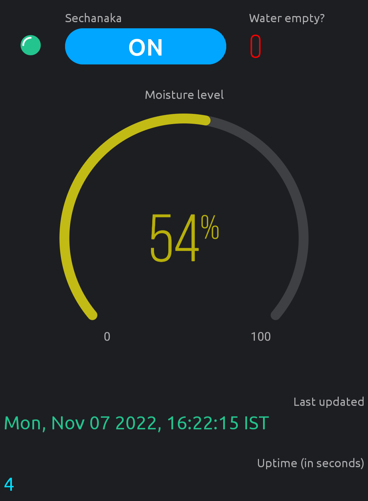
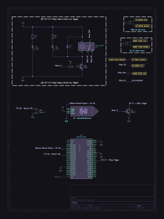

# Sechanaka

Sometimes cleaning your computer brings to notice some good things.

Sechanaka is yet another stupid plant auto-watering system utilizing NodeMCU32S, made for fun with friends (Anupam and Dev pls ping) during the boring and excruciating November 2022 (high academic load for innocent students is bad).

Integrated support for remote control and observation using Blynk. Yes, you can stop watering remotely.

When water is finished, a buzzer goes off at regular intervals (NOT continuously because it would be annoying) until the water is refilled.

The settings (like moisture range, buzzer interval time, etc.) are customisable so you can calibrate according to your needs — just change the values in the handy `#define` definitions at the start of code.

KiCAD schematic included in the repo. PCB is too much effort for this, just use a breadboard.

## Blynk Dashboard

## Schematic

Used Witch Hazel theme for the above SVG, which is plotted from the included KiCAD schematic.

NodeMCU32S symbol is made by user `glatho` on [SnapEDA](https://www.snapeda.com/parts/NODEMCU-32S/AI-Thinker/view-part/), and released under a CC-BY-SA-4.0 license.

---

